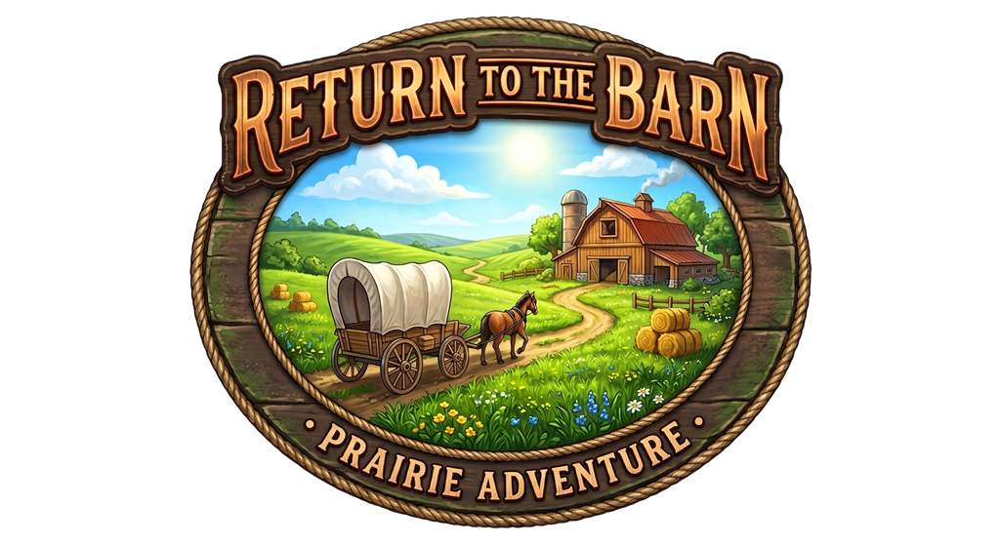

<p align="center">
  
</p>

<p align="center">
  <strong>Computer Graphics (CG) — FEUP · L.EIC 2025/2026</strong><br/>
  Class T04 · Group G06
</p>

<p align="center">
  Drive a prairie schooner across procedurally generated rolling hills,
  gather hay bales, and deliver them to the barn before your HP runs out.
</p>

---

A real-time WebGL scene built on the WebCGF framework — procedural terrain, custom
GLSL shaders, a day/night cycle, and bicycle-model wagon kinematics.

## Quick start

```bash
cd project
npx live-server .
```

Then click **Play**. Tested on recent Chrome and Firefox.

## Repository layout

- [`project/`](project/) — **Return to the Barn**, the course project (all original group work). See its [README](project/README.md) for the full feature list, controls, and screenshots.
- [`lib/`](lib/) — the WebCGF framework, a course-provided dependency the project builds on.
